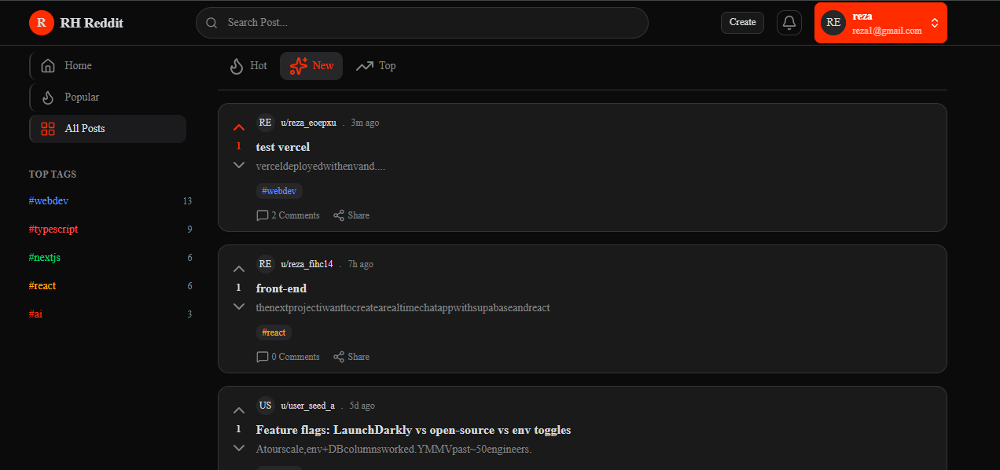

<div align="center">
   <h3 align="center">RH Reddit </h3>
   <br />

   <a href="https://rh-reddit.vercel.app" target="_blank">
      
   </a>

<br /><br />

   <div>
      
      
      
      
      
      
      
   </div>

   <br />

   <a href="https://rh-reddit.vercel.app" target="_blank">
      
   </a>
</div>
## 📋 Table of Contents

1. ✨ [Introduction](#introduction)  
2. 🛠 [Tech Stack](#tech-stack)  
3. 🚀 [Features](#features)  
4. 🤸 [Quick Start](#quick-start)  

---

## <a name="introduction">✨ Introduction</a>
RHreddit is a modern Reddit-inspired social platform where users can create posts, engage in discussions through comments, vote on content, and discover trending conversations. Built with Next.js, Prisma, Neon, and Tailwind CSS, it delivers a fast, scalable, and responsive user experience.

## <a name="tech-stack">🛠 Tech Stack</a>
- **[Next.js](https://nextjs.org/)** is a powerful React framework for building fast, scalable, and production-ready web applications with server-side rendering (SSR), static site generation (SSG), and built-in routing.

- **[TailwindCSS](https://tailwindcss.com/)** is a utility-first CSS framework that enables rapid UI development with fully customizable and responsive design utilities.

- **[shadcn/ui](https://ui.shadcn.com/)** is a modern component library built on top of Radix UI and Tailwind CSS, providing accessible, reusable, and beautifully designed UI components.

- **[Lucide React](https://lucide.dev/)** is a clean, consistent, and lightweight icon library used for modern UI development, especially with React and shadcn/ui components.

- **[Prisma](https://www.prisma.io/)** is a next-generation ORM for Node.js and TypeScript that simplifies database access with type-safe queries, migrations, and schema management.

- **[Neon](https://neon.com/)** is a serverless PostgreSQL platform designed for scalability, branching databases, and high-performance cloud-native applications.

## <a name="features">🚀 Features</a>

👉 **Authentication (BetterAuth)**:Secure and modern authentication system powered by BetterAuth for seamless sign-up and login.

👉 **Post Creation**:Users can create and publish posts to share content with the community.

👉 **Tag-Based Filtering**:Explore and filter posts based on tags for a more organized content discovery experience.

👉 **Comments System**:Engage in discussions by adding comments under posts.

👉 **Comment Replies (Nested Replies)**:Reply to comments and participate in structured threaded conversations.

👉 **Post Voting System**:Upvote and downvote posts to highlight the most valuable content.

👉 **Comment Voting System**:Users can also upvote and downvote comments to improve discussion quality. 

👉 **Responsive Design**:Fully optimized UI for mobile, tablet, and desktop using Tailwind CSS.

## <a name="quick-start">🤸 Quick Start</a>

Follow these steps to set up the project locally on your machine.

**Prerequisites**

Make sure you have the following installed on your machine:

- [Git](https://git-scm.com/)
- [Node.js](https://nodejs.org/en)
- [npm](https://www.npmjs.com/) (Node Package Manager)
  
1. **Cloning the Repository**

```bash
git clone https://github.com/rezaHosseini98/Rh_reddit.git
cd Rh_reddit
```
2. **Installation**
Install the project dependencies using npm:

```bash
npm install
```

**Set Up Environment Variables**

Create a new file named `.env` in the root of your project and add the following content:
```env
DATABASE_URL=
NEON_AUTH_BASE_URL=
NEON_AUTH_COOKIE_SECRET=
```

Replace the placeholder values with your real credentials. You can get DATABASE_URL and NEON_AUTH_BASE_UR by signing up at: [Neon](https://neon.com/)\.(Make sure to enable access to localhost in Neon so your local environment can connect properly to the database.)

**Generate Secrets**

To obtain NEON_AUTH_COOKIE_SECRET, run the following command in the root directory of your project:
```bash
openssl rand -base64 32
```
**Database Setup**

run the following command to execute the schema file and generate the database tables for Neon:
```bash
npm run db:push
```
For generating demo data for use in the project, run the following command:
```bash
npm run db:seed-cv
```
**Running the Project**

After receiving the success message indicating that the data has been successfully transferred, you can start the project using the following command:
```bash
npm run dev
```
Open [http://localhost:3000](http://localhost:3000) in your browser to view the project.
